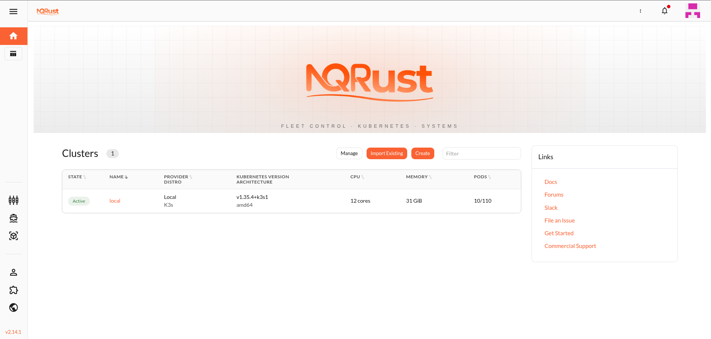
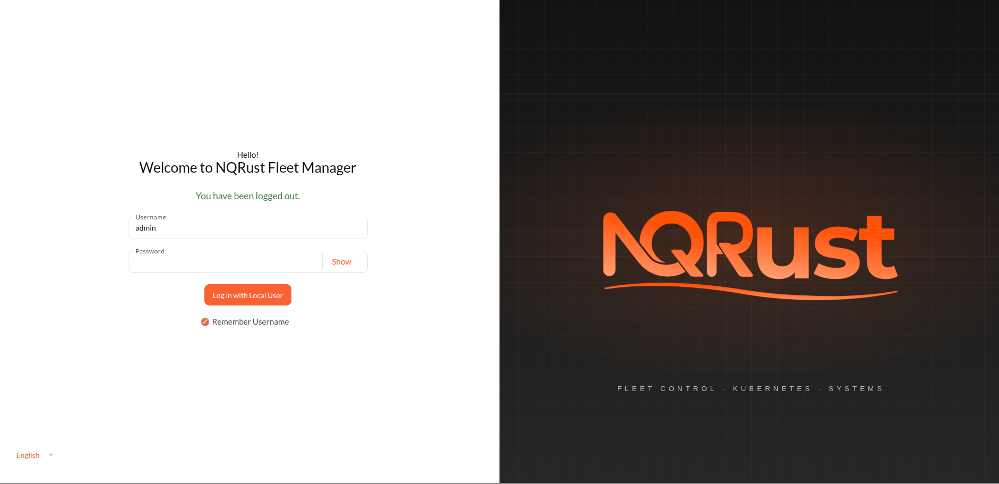
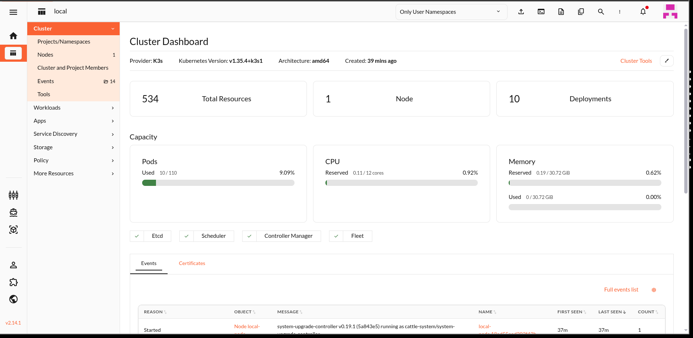

<div align="center">

# NQRust Fleet Manager

**A monochrome, brutalist control plane for Kubernetes — built on top of the [Rancher Dashboard](https://github.com/rancher/dashboard).**

[](./LICENSE)
[](https://vuejs.org/)
[](https://github.com/NexusQuantum)

<br>



</div>

---

## What it is

NQRust Fleet Manager is a UI fork of the SUSE Rancher Dashboard, reskinned end-to-end for high-density, systems-level workflows. It speaks to any Rancher backend without modification — same Steve API, same auth, same extension surface — and ships:

- A neutral OKLCH grayscale palette with **`#FF621B`** as the brand accent
- A shadcn-flavored density layer (38 px inputs, 36 px buttons, 1 px borders, focus rings)
- Google Material Symbols Outlined as the icon font (replacing the bespoke Rancher icon set)
- The full NQRust brand identity (logo, favicons, splash, banners, login landscape) in light + dark
- Original architecture untouched: Vue 3 / Composition API / TypeScript / SCSS, the upstream Vuex store, the BrandImage system, all theme switching plumbing

If you're looking for a clean, opinionated Rancher reskin that you can point at your existing rancher backend and ship today — this is that.

---

## Showcase

<table>
  <tr>
    <td align="center"><strong>Home</strong></td>
    <td align="center"><strong>Cluster</strong></td>
  </tr>
  <tr>
    <td></td>
    <td></td>
  </tr>
</table>

---

## Quick start

NQRust Fleet Manager is the UI only. You need a running Rancher backend to point it at — any version that the upstream dashboard supports works.

```bash
# 1. install deps
yarn install --frozen-lockfile

# 2. run the dev server against your Rancher
API=https://your-rancher-server yarn dev

# UI lives at https://127.0.0.1:8005
```

For a local-only sandbox you can spin up Rancher in Docker:

```bash
docker run -d --restart=unless-stopped \
  --name nqrust-rancher --privileged \
  -p 127.0.0.1:80:80 -p 127.0.0.1:443:443 \
  rancher/rancher:latest

# Read the bootstrap password
docker logs nqrust-rancher 2>&1 | grep "Bootstrap Password"

# Then in another terminal
API=https://localhost yarn dev
```

---

## Build

```bash
yarn build           # production bundle
yarn lint            # ESLint
yarn test:ci         # Jest unit tests
yarn cy:run          # Cypress e2e
```

---

## Architecture notes

The reskin is a single cascade-final SCSS overlay (`shell/assets/styles/themes/_nqrust.scss`) plus a Material Symbols icon override (`shell/assets/styles/themes/_nqrust-icons.scss`) — both imported last in `app.scss` so they win the cascade without touching any upstream theme file.

The brand is delivered through:
- `shell/assets/images/pl/` — light + dark logo, banner, login landscape (with embedded `Logo.png`)
- `shell/assets/brand/suse/` — overrides the default brand variant so existing brand-switching logic continues to work
- `shell/static/favicon.{ico,png}` — favicons
- `shell/config/private-label.js` — vendor name / product name constants
- `shell/components/Cluster*.vue` — local-cluster icon (replaced with the NQRust fleet-stack mark)
- `shell/assets/translations/en-us.yaml` — UI strings for vendor-facing labels

No backend bindings, Vuex stores, route definitions, API URLs, CRD references, or extension hooks were modified.

---

## Attribution

This project is a fork of [`rancher/dashboard`](https://github.com/rancher/dashboard) (Apache License 2.0, © Rancher Labs / SUSE). The upstream code remains under its original Apache 2.0 license — a copy is preserved as [`LICENSE-APACHE-2.0`](./LICENSE-APACHE-2.0) and all upstream copyright notices are intact. The combined work (NQRust branding, theme system, structural changes, plus the upstream code as integrated here) is distributed under the GNU Affero General Public License v3.0 — see [`NOTICE.md`](./NOTICE.md) for the breakdown.

To pull future Rancher Dashboard updates into this fork:

```bash
git remote add upstream https://github.com/rancher/dashboard.git
git fetch upstream
git merge upstream/master
```

---

## License

GNU Affero General Public License v3.0. See [`LICENSE`](./LICENSE). Upstream Apache 2.0 components are preserved under [`LICENSE-APACHE-2.0`](./LICENSE-APACHE-2.0).
