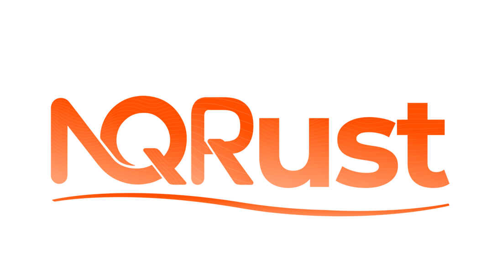

<div align="center">



<br>

**A monochrome control plane for Kubernetes clusters**

Multi-cluster operations · Workload management · Real-time observability
Self-hosted · Extension-ready · No vendor lock-in

[](https://vuejs.org/)
[](https://www.typescriptlang.org/)
[](https://kubernetes.io/)
[](./LICENSE)

[Install →](#quick-start) · [Architecture](#architecture) · [Showcase](#showcase) · [Report a Bug](https://github.com/NexusQuantum/NQRust-FleetManager/issues)

</div>

---

## Showcase

<table>
  <tr>
    <td></td>
  </tr>
  <tr>
    <td align="center"><strong>Login</strong></td>
  </tr>
  <tr>
    <td></td>
  </tr>
  <tr>
    <td align="center"><strong>Home</strong></td>
  </tr>
  <tr>
    <td></td>
  </tr>
  <tr>
    <td align="center"><strong>Cluster</strong></td>
  </tr>
</table>

---

## What it is

NQRust Fleet Manager is a Vue 3 / TypeScript user interface for operating fleets of Kubernetes clusters. It combines:

- A neutral OKLCH grayscale palette with **`#FF621B`** as the brand accent
- A shadcn-flavored density layer — 38 px inputs, 36 px buttons, 1 px borders, focus rings
- Google Material Symbols Outlined for the entire icon set
- The full NQRust brand identity in light + dark
- A self-hosted, extension-ready Kubernetes management workflow
- Composition API throughout, full Vuex state, full TypeScript

Point it at any Steve-API Kubernetes management backend and ship.

---

## Quick start

A zero-to-running walkthrough. Takes ~10 minutes on a clean machine.

### Prerequisites

- **Node.js ≥ 24** — recommended via [`mise`](https://mise.jdx.dev/), [`nvm`](https://github.com/nvm-sh/nvm), or [`fnm`](https://github.com/Schniz/fnm)
- **Yarn 1.22+** — install once globally via `npm install -g yarn`
- **Docker** — for the local backend sandbox
- A modern browser (Chromium-based or Firefox) that accepts self-signed TLS certs

### 1. Clone and install

```bash
git clone https://github.com/NexusQuantum/NQRust-FleetManager.git
cd NQRust-FleetManager
yarn install --frozen-lockfile
```

The install pulls ~650 MB of `node_modules` and takes 3-5 minutes.

### 2. Spin up a backend

NQRust Fleet Manager is the UI only — it needs a Steve-API Kubernetes management server to talk to. The fastest way to get one locally is Docker:

```bash
docker run -d --restart=unless-stopped \
  --name nqrust-backend --privileged \
  -p 127.0.0.1:80:80 -p 127.0.0.1:443:443 \
  rancher/rancher:latest
```

The container ships with bundled k3s and bootstraps in 1-3 minutes. Wait for the bootstrap password to appear in its logs:

```bash
docker logs nqrust-backend 2>&1 | grep "Bootstrap Password"
# → 2026/05/08 ... [INFO] Bootstrap Password: <copy this>
```

Verify the API is ready:

```bash
curl -k https://localhost/ping
# → pong
```

### 3. Run the UI

In a second terminal, point the dev server at the backend:

```bash
API=https://localhost yarn dev
```

Webpack compiles for ~30 seconds, then prints:

```
  App running at:
  - Local:   https://localhost:8005/
```

### 4. First login

Open **https://localhost:8005/** — accept the self-signed cert warning. On the login screen:

- **Username:** `admin`
- **Password:** the bootstrap password from step 2

You'll be prompted to set a new password and accept the EULA on first login. After that you're in.

### 5. Develop

The dev server hot-reloads on every Vue / SCSS / TypeScript change. The reskin entry points are:

- `shell/assets/styles/themes/_nqrust.scss` — theme tokens, density, layout overrides
- `shell/assets/styles/themes/_nqrust-icons.scss` — Material Symbols icon mapping
- `shell/assets/images/pl/` and `shell/assets/brand/suse/` — brand assets
- `shell/config/private-label.js` — vendor / product name constants

To pull future upstream improvements into the fork:

```bash
git fetch upstream
git merge upstream/master
```

### Stop / cleanup

```bash
# Stop the dev server: Ctrl-C in its terminal
# Stop the backend
docker stop nqrust-backend && docker rm nqrust-backend
# Or pause without removing
docker stop nqrust-backend
```

### Pointing at an existing backend

If you already have a Rancher-compatible server running somewhere, skip step 2 and substitute its URL into step 3:

```bash
API=https://your-rancher-server yarn dev
```

---

## Build

```bash
yarn build           # production bundle
yarn lint            # ESLint
yarn test:ci         # Jest unit tests
yarn cy:run          # Cypress e2e
```

---

## Architecture

The reskin is delivered through two cascade-final SCSS overlays loaded last in `app.scss`:

- `shell/assets/styles/themes/_nqrust.scss` — every theme token remapped to OKLCH neutrals + `#FF621B` accent (light + dark, plus all upstream brand variants), structural density (buttons, inputs, tables, sidebar, modals, scrollbar, selection, focus rings)
- `shell/assets/styles/themes/_nqrust-icons.scss` — `[class^="icon-"]` font-family forced to Material Symbols Outlined, all 146 icon names remapped to Material ligatures

Brand assets live under `shell/assets/images/pl/` (light + dark) and `shell/assets/brand/suse/` (default-brand mirror so existing brand-switching logic continues to function). Vendor / product-name constants are in `shell/config/private-label.js`. The local-cluster mark is a brutalist fleet-stack glyph defined inline in `shell/components/ClusterIconMenu.vue` and `shell/components/ClusterProviderIcon.vue`.

The architecture is otherwise upstream-identical: backend bindings, Vuex stores, route definitions, API URLs, CRD references, extension hooks, and i18n surface (outside the small set of vendor-facing strings) are unchanged.

To pull future upstream updates:

```bash
git fetch upstream
git merge upstream/master
```

---

## License & attribution

The combined work is distributed under the **GNU Affero General Public License v3.0** — see [`LICENSE`](./LICENSE).

This project incorporates code from [`rancher/dashboard`](https://github.com/rancher/dashboard) (Apache License 2.0, © Rancher Labs / SUSE). Upstream code retains its original Apache 2.0 license — preserved verbatim at [`LICENSE-APACHE-2.0`](./LICENSE-APACHE-2.0) — and all upstream copyright notices remain in place. See [`NOTICE.md`](./NOTICE.md) for the complete licensing breakdown.
